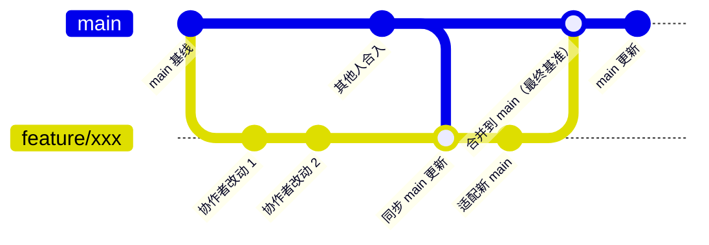

# Git 协作指南（AOSC 卫星开源组织框架）

> 适用：本仓库全部协作者（含远程协作者，如 inotguoya 等）
> 核心原则：**main 是唯一权威分支**，由仓库所有者维护，始终保持可发布状态；所有开发在各自分支进行，完成后统一合并到 main
> 更新：2026-08-12

---

## 一、分支策略

| 分支 | 归属 | 说明 |
|------|------|------|
| `main` | 所有者 | 唯一权威分支，最终合并目标；直接推送仅限所有者 |
| `feature/<描述>` | 协作者 | 功能/任务分支，命名建议：`feature/<任务名>` 或 `<用户名>/<任务名>` |

- 协作者**不直接推送 main**，在 feature 分支工作后合并到 main
- 合并方式：由协作者发起合并请求（PR / Merge Request），或完成后通知所有者合入

---

## 二、协作者工作流（一次任务的完整步骤）

### 第 1 步：克隆仓库并同步 main（首次）

```bash
git clone https://github.com/mkewsds12/AOSC.git
cd AOSC
git checkout main
git pull origin main
```

### 第 2 步：从最新 main 创建功能分支

```bash
git checkout main
git pull origin main          # 先确保 main 最新
git checkout -b feature/xxx   # 基于最新 main 建分支
```

### 第 3 步：开发并提交

```bash
git add <改动文件>            # 或 git add -A 全部
git commit -m "描述性提交信息（中文，说明改了什么）"
```

- 提交信息写清楚：如"新增 XX 组织镜像卡片 / 更新行业新闻速递"
- 建议按逻辑分多次提交，不要一个大提交包含所有内容

### 第 4 步：开发期间同步 main 的更新（重要）

> 当 main 有新提交（其他人合入）时，先把自己的分支更新到最新，避免合并时冲突堆叠。

```bash
git checkout main
git pull origin main          # 拉取 main 最新
git checkout feature/xxx
git merge main                # 把 main 合进自己的分支（推荐 merge 而非 rebase）
# 如有冲突：解决冲突后 git add <文件> && git commit
```

### 第 5 步：推送功能分支

```bash
git push origin feature/xxx
```

### 第 6 步：合入 main（两种方式）

**方式 A：协作者发起合并请求（推荐）**
1. 在 GitHub 仓库页面 → Pull Requests → New Pull Request
2. base 选 `main`，compare 选 `feature/xxx`
3. 描述改动内容，等待所有者合并

**方式 B：通知所有者合并**
- 在会话/群中告知分支名与改动内容，由所有者在本地执行：

```bash
git checkout main
git pull origin main
git merge origin/feature/xxx   # 或 git merge feature/xxx
# 解决冲突后提交
git push origin main
```

### 第 7 步：合并完成后清理

```bash
git checkout main
git pull origin main
git branch -d feature/xxx      # 本地删除
git push origin --delete feature/xxx   # 远程删除
```

---

## 三、冲突处理规则（重要）

- **以 main（所有者）版本为最终基准**：合并时若同一文件两边都改，默认保留 main 的版本，协作者需要把自己的改动重新应用到 main 最新内容之上
- 冲突解决步骤：
  1. `git status` 查看冲突文件
  2. 打开冲突文件，搜索 `<<<<<<<` / `=======` / `>>>>>>>` 标记
  3. 手动保留正确内容（涉及目录改名/栏目调整时，以 main 的新结构为准）
  4. `git add <文件>` → `git commit`
- **改名冲突特别提醒**：本项目常用 `git mv` 调整目录（如栏目改名、资源领域改名）。协作者合并 main 后，若发现路径对不上，先 `git pull` 最新 main，再把自己的改动适配到新路径

---

## 四、常用命令速查

| 场景 | 命令 |
|------|------|
| 拉取最新 main | `git checkout main && git pull origin main` |
| 建功能分支 | `git checkout -b feature/xxx` |
| 查看状态 | `git status` |
| 查看分支 | `git branch -a` |
| 查看未推送提交 | `git log origin/main..HEAD --oneline` |
| 合并 main 到当前分支 | `git merge main` |
| 推送分支 | `git push origin feature/xxx` |
| 放弃本地改动 | `git checkout -- <文件>` |
| 查看冲突文件 | `git diff --name-only --diff-filter=U` |

---

## 五、注意事项

1. **main 只由所有者推送**：协作者不要 `git push origin main`，否则会被拒绝或造成混乱
2. **动手前先 pull**：任何操作前先 `git pull`，改完立即 commit + push，避免长时占用分支
3. **避免两人同时改同一目录**：如需改动同一区域（如某组织文件夹、某栏目），先沟通分工
4. **大文件**：安装包等大文件（单文件 ≤200MB）按资源发布规范放入 `发布内容/资源发布/安装文件/`，不要直接塞进仓库根目录
5. **目录改名走 git mv**：不要用系统复制+删除，用 `git mv` 保留历史
6. **合并前确认 main 领先**：`git rev-list --left-right --count origin/main...HEAD`，左边为远程领先数，右边为本地领先数；合并前应确认自己分支基于最新 main

---

## 六、分支更新逻辑速览（一张图）


