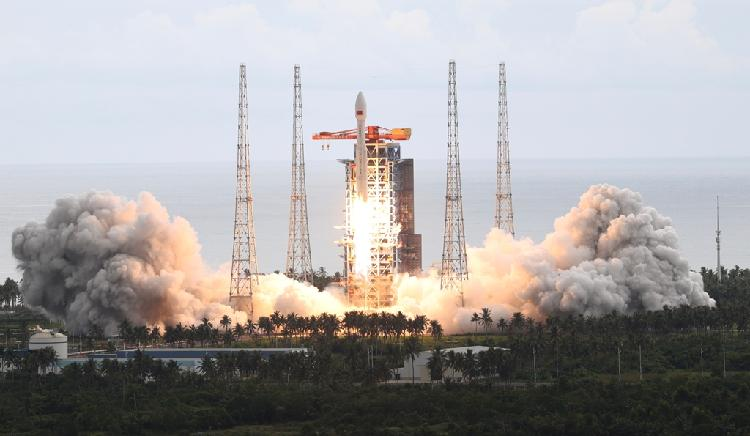

# 行业新闻 · 2026 年 8 月最新动态

> 栏目：行业新闻（后台：资讯管理 → 资讯列表 → 新增）
> 用途：搬运国内外航天 / 开源行业最新动态（只发 1 周内新闻，须注明来源）
> 整理日期：2026-08-10
> 图片目录：`图片/`（本文件夹内）

---

## 新闻一：中国成功发射低轨卫星互联网第 23 批卫星

- 标题：中国成功发射低轨卫星互联网第 23 批组网卫星
- 概览：8 月 4 日，我国在海南商业航天发射场用长征八号甲火箭发射低轨卫星互联网第 23 批卫星（来源：CGTN）。
- 首图：

- 正文：8 月 4 日，我国在海南文昌商业航天发射场成功发射低轨卫星互联网星座第 23 批组网卫星，火箭为完成性能升级后的长征八号甲（CZ-8A），于北京时间 16:52 起飞并将卫星送入预定轨道。本次任务是长征八号甲性能升级后的全系统验证飞行，升级提升了火箭运载能力，为后续大规模、高频次组网发射奠定基础。低轨宽带星座的持续组网，正推动卫星互联网从小规模试验走向规模化部署，这也是航天开源社区持续关注的方向。（来源：CGTN，[原文链接](https://news.cgtn.com/news/2026-08-04/China-launches-23rd-group-of-low-Earth-orbit-internet-satellites-1Pl8pLQq2qs/p.html)）

---

## 新闻二：NASA 开源模型 Prithvi 成为首个在轨运行的 AI 地理空间基础模型

- 标题：NASA 开源模型 Prithvi 成为首个在轨运行的 AI 地理空间基础模型
- 概览：NASA 与 IBM 联合开源的 Prithvi 地理空间基础模型已成功部署至在轨平台，成为首个在轨运行的此类模型（来源：NASA Science）。
- 首图：

- 正文：由阿德莱德大学、ESA Φ-lab、泰雷兹阿莱尼亚航天公司与澳大利亚 SmartSat 合作研究中心组成的团队，成功将 NASA 与 IBM 开源的 Prithvi 地理空间 AI 基础模型上注至澳大利亚 Kanyini 卫星与国际空间站 IMAGIN-e 载荷，使其成为首个在轨部署的地理空间基础模型。Prithvi 基于 13 年的 Landsat 与 Sentinel-2 数据训练，可支撑洪水制图、灾害监测、作物估产等多种对地观测任务；在轨只需上注轻量任务头即可扩展新能力，大幅节省带宽。NASA 首席科学数据官 Kevin Murphy 表示，开源正是这一突破的关键，向所有人共享工具可加速科技发展。（来源：NASA Science，[原文链接](https://science.nasa.gov/science-research/ai-foundation-model-in-orbit/)）

---

## 新闻三：JAXA 开源 Open-SET 卫星星上计算软件平台

- 标题：JAXA 开源 Open-SET 卫星星上计算软件平台
- 概览：JAXA 开源的 Open-SET 星上计算软件平台，采用 Linux + 容器技术，让卫星应用像地面云原生应用一样开发部署（来源：GitHub/JAXA）。
- 正文：JAXA 开源的 Open-SET（Open Satellite/Service/Software Enhancement Technology）是面向卫星星上计算的软件平台，以 Linux 为操作系统、采用容器技术运行应用，使开发者可将地面开发的程序直接部署到航天器，显著简化卫星软件开发流程。平台提供事件总线、FDIR 故障检测隔离恢复与服务管理三大核心模块，集成 Mosquitto、Prometheus 等开源组件，并在发布配套的深度学习目标检测在轨部署教程，是软件定义卫星与星上边缘计算方向的重要开源参考。航天开源社区已将 Open-SET 纳入星务处理与算法处理方向的收录清单。（来源：GitHub/jaxa/open-set，[原文链接](https://github.com/jaxa/open-set)）

---

## 新闻四：EarthSight——面向低时延卫星智能的分布式开源框架

- 标题：EarthSight：面向低时延卫星智能的分布式开源框架
- 概览：开源框架 EarthSight 通过星上推理与地面站调度协同，将卫星影像端到端交付时延从 51 分钟降至 21 分钟，论文入选 MLSys 2026（来源：GitHub/scai-tech）。
- 正文：EarthSight 是一个面向低时延卫星智能的分布式运行时系统，通过将机器学习推理迁移到星上进行，并与地面站调度协同，显著降低卫星影像交付时延。相比传统"先下行后分析"的流程，EarthSight 使单图平均计算时间提升 1.9 倍，端到端第 90 百分位时延从 51 分钟降至 21 分钟。其核心创新包括共享骨干网络的多任务推理，以及基于 6 小时前瞻仿真的地面站查询调度器。该项目论文已入选 MLSys 2026，代码以开源形式发布，是星上计算与智能星座方向的前沿参考。（来源：GitHub/scai-tech/EarthSight，[原文链接](https://github.com/scai-tech/EarthSight)）

---

## 附：图片文件清单

| 文件 | 说明 | 来源 |
| :--- | :--- | :--- |
| `图片/china-23rd-leo-satellites.jpg` | 中国低轨卫星互联网第 23 批卫星发射（文昌） | CGTN |
| `图片/nasa-prithvi-on-orbit.jpg` | NASA Prithvi 在轨部署（ISS 视角佛罗里达） | NASA Science |
